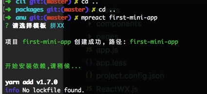

# 安装

首先要我们要`安装命令`与下载`微信开发者工具`。

其次要求nodejs 版本大于8.0

```shell
git clone git@github.com:RubyLouvre/anu.git
# 或 git clone https://github.com/RubyLouvre/anu.git
```

1 下载回来，进入anu目录，再进入**packages/cli**目录，即`cd anu/packages/cli`, 执行`npm link`<br />
  如果之前装过要先`npm unlink` <br />
2 使用`mpreact <project-name>` 创建工程, 选择模板<br />
3 定位到 `<project-name>` 目录下 `mpreact start` 开始监听文件变化，<br />
4 用微信开发者工具打开当中的dist目录，自己在src目录中进行开发



[接下来我们看src的开发目录吧](src.md)

里面有

1 dist,用来放编译好的文件，给微信运行的

2 src, 用来开发

3 packages.json用来添加依赖，如果你需要什么新依赖，你可以在当前工程下，｀npm i xxx`

重点讲src

src里面assets, 放静态资源，所有静态资源都应该放在这里
components用来放业务组件
pages用来页面组件
app.js为应用组件

其他文件基本不用动。

我们可以访问下面链接详细了解这三种组件，我们的开发也围张它们进行。

[应用组件](app.md)
[页面组件](page.md)
[通用组件](component.md)

